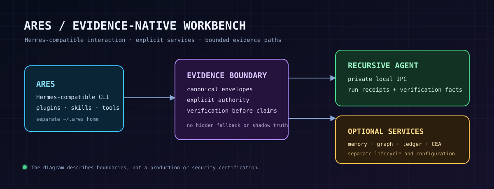

<p align="center">
  
</p>

# Ares

**An evidence-native, Hermes-compatible AI workbench for bounded execution, inspectable state, and explicit operator control.**

Ares is a **downstream distribution** of [Hermes Agent](https://github.com/NousResearch/hermes-agent), maintained by [RecursiveIntell](https://github.com/RecursiveIntell). It keeps the established Python package and `hermes` CLI so existing Hermes integrations remain usable, while adding a separately maintained integration layer for evidence-oriented local workflows.

> [!IMPORTANT]
> **Ares is not regular Hermes and is not an official Nous Research product.** It is a distinct fork with its own installer, default home directory, documentation front door, and optional RecursiveIntell integrations. Upstream Hermes remains the compatibility base; Ares-specific claims apply only to this fork and the explicitly installed components described below.

[Install Ares](#quick-start) · [What changes](#what-makes-ares-distinct) · [Integration boundaries](#integration-boundaries) · [Security model](#security-and-trust-boundaries) · [Upstream Hermes](https://github.com/NousResearch/hermes-agent)

## Who Ares is for

Use Ares when you want a local agent workbench where important work can be bounded, inspected, and connected to durable evidence—not merely summarized after the fact. It is aimed at technical operators working on code, research, or automation who are willing to make model/provider, service, and authority choices explicitly.

Ares is **not** a claim of autonomous production operations, a replacement for operating-system isolation, or a bundled guarantee that every optional service is present. If you only want the standard Hermes experience, use upstream Hermes.

## What makes Ares distinct

| Surface | Upstream compatibility retained | Ares position |
|---|---|---|
| Agent runtime | Python package and `hermes` CLI remain intact | Ares adds an `ares` launcher and uses `~/.ares` by default, avoiding accidental mutation of an existing `~/.hermes` profile. |
| Capability model | Plugins, skills, MCP, and toolsets still define extension boundaries | Ares favors explicit, separately installed services over silently widening core authority. |
| Execution evidence | Hermes can run tools through its normal approval and toolset model | The optional Recursive Agent plugin submits one canonical bounded action through local authenticated IPC and returns daemon-derived verification facts. |
| Memory and orchestration | Hermes’s normal providers and MCP client remain available | Semantic memory, Agent Graph, Claim Ledger, CEA Graph, and Pilot Bridge remain opt-in external services with independent lifecycle and configuration. |
| Documentation | Existing Hermes documentation remains useful for compatible surfaces | This README and the Ares guide state what is fork-owned, optional, locally verified, or unverified. |

## Quick start

### Prerequisites

- Git
- [uv](https://docs.astral.sh/uv/)
- Python **3.11–3.13** (the project metadata rejects Python 3.14)
- A model provider configured through the normal Hermes setup flow

The Ares bootstrap targets Unix-like shells (Linux, macOS, and WSL). The standard Hermes package and CLI remain the compatibility interface; the bootstrap adds the `ares` launcher.

Windows users should note that [`scripts/install.ps1`](scripts/install.ps1) is
the upstream Hermes installer included for compatibility testing; it is not an
Ares-isolated installer and therefore does not replace the Ares bootstrap
above. Use WSL for a supported Ares installation until an Ares-specific
PowerShell bootstrap is released.

### Install from this fork

Review the installer before executing it, then clone and run it locally:

```bash
git clone https://github.com/RecursiveIntell/Ares.git Ares
cd Ares
uv sync --locked --extra all
.venv/bin/ares setup --source "$PWD"
```

The one-time setup creates:

- Ares agent home and independent configuration: `~/.ares/`
- stable runtime releases: `~/.ares/runtime/releases/<commit>/`
- atomic current/previous runtime pointers: `~/.ares/runtime/current` and `previous`
- Ares control state: `~/.ares/runtime-state/`
- launcher: `~/.local/bin/ares`
- gateway service: `ares-gateway.service`

On first setup, Ares explicitly snapshots the existing `~/.hermes` settings, credentials, installed skills, plugins, and profiles into `~/.ares` so the current agent configuration works without manual re-entry. It never uses `~/.hermes` as a fallback afterward: the two installations can be updated, configured, and run independently. The development checkout remains separate and is never used as a fallback after setup.

If `~/.local/bin` is not on your `PATH`, add it using your shell’s normal profile mechanism. Then configure a provider and verify the runtime:

```bash
ares setup
ares --version
ares doctor
```

A successful `ares --version` proves the generated launcher can reach the selected stable Hermes-compatible runtime. `ares doctor` is the next diagnostic gate; provider setup is not complete until you have supplied your own provider credentials through the supported local flow. Use `ares tui`, `ares desktop`, and `ares gateway status` for normal operation. `ares update` fetches the configured Hermes upstream into staging, applies the Ares delta there, builds the resulting release candidate, and switches only after that candidate succeeds. If the patch or build fails, the active release is unchanged; `ares rollback` returns to the previous release.

### Install the Recursive Agent plugin (optional)

The Recursive Agent integration is a standalone plugin, not a bundled core tool. It needs a separately built and running local Recursive Agent daemon before it can execute a request.

From an existing `RecursiveIntell/recursive-agent` checkout:

```bash
cd /path/to/ares
bash install.sh --with-recursive-agent-source /path/to/recursive-agent
```

This copies the plugin’s declared runtime package into `~/.ares/plugins/recursive-agent-native`. It does **not** build, configure, start, or grant authority to the daemon. After the daemon is independently running, start a fresh Ares/Hermes session so plugin discovery can occur.

For the daemon contract, allowed operation envelope, socket requirements, receipts, and verification semantics, see the [Ares Recursive Agent integration guide](docs/ares-recursive-agent.md).

## Integration boundaries

Ares intentionally keeps the following layers separate:

```text
operator ──> Ares / Hermes-compatible runtime ──> plugins, MCP servers, approved tools
                         │
                         └── optional Recursive Agent plugin
                                  │ local authenticated IPC
                                  v
                           Recursive Agent daemon
                                  │
                                  └── bounded run + receipt chain + verification result
```

- **Hermes-compatible runtime** owns conversation, model routing, tool selection, approvals, plugins, and normal persistence.
- **Ares** owns the downstream distribution identity, installer behavior, documentation boundaries, and integration policy in this repository.
- **Recursive Agent** owns its run contract, state machine, receipt chain, and verification result. The plugin does not manufacture evidence or bypass the daemon.
- **MCP services** remain separate processes/services. Configure each one intentionally; a registered tool is not proof that its backend is available or exercised.

The repository includes optional RecursiveIntell transport modules for `llm-pipeline`, `context-governor`, `agent-graph`, and `poly-kv`. Their presence in source is **not** a promise that native extensions are installed, active, or applicable to every provider. Each path must be admitted and verified in the environment where it is used.

## A concrete evidence workflow

A bounded certification run is the clearest current use case:

1. Define one admissible operation, such as a repository validation bundle.
2. Submit it through the optional Recursive Agent plugin.
3. Let the daemon record the terminal state and receipt-chain facts.
4. Verify the returned chain before using the result to support a decision or claim.
5. Export or attach the resulting evidence through the relevant governed service only when that integration is separately configured.

This is different from treating a chat summary as proof. Ares can expose a path to durable run evidence; it does not make a result trustworthy unless the relevant run and verification actually succeeded.

## Configuration and operations

Ares preserves the Hermes-compatible configuration format but owns `~/.ares` as an independent agent home. The `ares` launcher sets the runtime process to that home only; Hermes and Ares can therefore use different providers, skills, plugins, sessions, and gateway lifecycles on the same machine without mutating one another.

The first-run migration preserves any explicitly configured external service paths so that existing Semantic Memory, AgentGraph, and other integrations continue to work. Those optional services remain shared until their endpoint and storage configuration is deliberately changed in the Ares home; the runtime launcher itself does not silently fall back to Hermes state.

Do not copy structured configuration blindly between homes. In particular:

- keep provider secrets in the local secret mechanism, never in this repository or in shell history;
- configure MCP server mappings and argument lists as typed YAML, not ad-hoc strings;
- install and review plugins before loading them—they run with agent-process authority;
- restart or start a new session after changing plugin, toolset, MCP, or credential configuration because the tool schema is session-scoped;
- prove a capability at the right layer: selected, registered, exposed, then exercised.

The bootstrap has intentionally narrow flags:

| Flag | Effect |
|---|---|
| `--branch NAME` | Clone or update a specific branch. |
| `--dir PATH` | Select the source checkout directory. |
| `--hermes-home PATH` | Select the Ares data directory. |
| `--ares-bin-dir PATH` | Select where the `ares` launcher is written. |
| `--no-venv` | Use the active Python environment instead of a managed virtual environment. |
| `--with-recursive-agent-source PATH` | Install only the standalone plugin from an existing Recursive Agent checkout; the daemon remains operator-managed. |

Run `bash install.sh --help` for the current installer contract. The bootstrap refuses to update a dirty existing checkout and refuses to overwrite a non-Ares launcher.

## Security and trust boundaries

Ares inherits Hermes’s fundamental security posture: **the operating system or an explicit whole-process sandbox is the real boundary against adversarial model output.** Approval prompts, tool allowlists, plugin review, redaction, and receipts are useful controls; they are not containment.

Important consequences:

- a plugin runs with the authority of the agent process; review it before installation;
- a local IPC socket or a verified receipt does not contain a compromised process;
- do not give an agent access to files, credentials, network destinations, or destructive tools you would not delegate to it;
- use a whole-process wrapper or a deliberately constrained account when handling untrusted content or higher-risk workloads.

Read [SECURITY.md](SECURITY.md) before exposing Ares to untrusted inputs or shared environments.

## Status and claim boundary

**Observed locally (2026-08-10):** the standalone Recursive Agent plugin loaded through a fresh Hermes plugin registry, registered `recursive_agent_execute` in the `recursive_agent` toolset, reached a private local Unix socket, and returned a terminal verified run with a receipt chain.

**Not established by that local smoke:** cross-platform support, public release packaging for the Recursive Agent daemon, a managed service installer, production readiness, security certification, or performance superiority. Treat those as separate verification projects.

## Repository map

| Path | Role |
|---|---|
| `install.sh` | Ares bootstrap installer; keeps configuration and optional services explicit. |
| `agent/transports/ri_*.py` | Optional RecursiveIntell transport/acceleration integration modules. |
| `docs/ares-recursive-agent.md` | Standalone Recursive Agent boundary and operator guide. |
| `website/` | Ares documentation front door plus Hermes-compatible reference material. |
| `tests/test_ares_distribution.py` | Contract checks for fork identity and installer scope. |

## Development and validation

Ares is a fork of a large Python, TypeScript, and desktop codebase. Start with the repository instructions and upstream-compatible development contract:

```bash
scripts/run_tests.sh
python3 /home/sikmindz/.hermes/skills/software-development/ultimate-readme/scripts/readme_audit.py README.md --repo-root .
bash -n install.sh
bash install.sh --help
```

The README audit is a static guard, not proof that a full installation, model provider, or optional service worked. For contribution setup and test conventions, read [AGENTS.md](AGENTS.md) and [CONTRIBUTING.md](CONTRIBUTING.md).

## Upstream provenance, contributions, and license

Ares is derived from [NousResearch/hermes-agent](https://github.com/NousResearch/hermes-agent). Preserve upstream attribution and license notices when redistributing or contributing changes. Ares-specific issues belong in the [RecursiveIntell fork issue tracker](https://github.com/RecursiveIntell/hermes-agent/issues); upstream Hermes behavior should be checked against upstream before filing a downstream-only report.

- Security reporting: [SECURITY.md](SECURITY.md)
- Contribution process: [CONTRIBUTING.md](CONTRIBUTING.md)
- License: [MIT](LICENSE)
